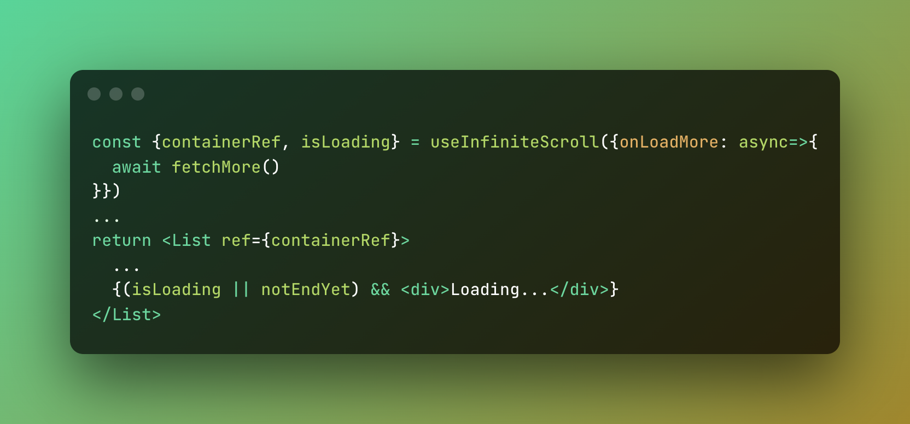

<h1 align="center">🧻 infinite-scroll-hook (React)</h1>

<p align="center">
  <a href="https://github.com/iamyoki/infinite-scroll-hook/actions/workflows/test.yml"></a>
  <a href="https://github.com/iamyoki/infinite-scroll-hook/actions/workflows/release.yml"></a>
  <a href="https://github.com/iamyoki/infinite-scroll-hook">
    
  </a>
  <a href="https://github.com/iamyoki/infinite-scroll-hook">
    
  </a>
</p>

<br>
<p align="center"><strong>Scroll down to load more never been so easy!</strong></p>
<br>

<p align="center">
  <a href="https://codesandbox.io/s/try-infinite-scroll-hook-jo6uxc?file=/src/App.jsx" target="_blank">
    
  </a>
</p>

<br>

<p align="center">
  <a href="https://codesandbox.io/s/try-infinite-scroll-hook-jo6uxc?file=/src/App.jsx">See Example in Codesandbox</a>
</p>

<br>

- [Installation](#installation)
- [Usage](#usage)
  - [Simple usage](#simple-usage)
  - [Offset](#offset)
  - [Stop load more](#stop-load-more)
- [API Reference](#api-reference)
- [License](#license)

<br>

## Installation

Install with yarn

```bash
yarn add infinite-scroll-hook
```

Or install with npm

```bash
npm install infinite-scroll-hook --save
```

## Usage

### Simple usage

```jsx
export default function App() {
  const [list, setList] = useState([...Array(11).keys()])
  const { containerRef, isLoading } = useInfiniteScroll({
    async onLoadMore() {
      const res = await fetchList(list.slice(-1)[0])
      setList(list.concat(res))
    },
  })

  return (
    <div className="App">
      <List ref={containerRef}>
        {list.map((n) => (
          <Item key={n}>{n}</Item>
        ))}
        {isLoading && <Loading>Loading ...</Loading>}
      </List>
    </div>
  )

```

### Offset

Will load more while scrolling hit to bottom offset '200px'

```jsx
const { containerRef, isLoading } = useInfiniteScroll({offset: '200px'})
...
```

All css size units available

- `offset: 200px` ✅
- `offset: 20%` ✅
- `offset: 20vh` ✅
- `offset: 20cm` ✅
- ...

### Stop load more

Stops when finished

```jsx
const { containerRef, isLoading } = useInfiniteScroll({shouldStop: isFetchEnd})
...

return (
    <div className="App">
      <List ref={containerRef}>
        {list.map((n) => (
          <Item key={n}>{n}</Item>
        ))}
        {(isLoading || !isFetchEnd) && <Loading>Loading ...</Loading>}
      </List>
    </div>
  )
```

## API Reference

```js
  const {containerRef, isLoading} = useTransition(options)
```

| Parameters | Type                                                                          | Description               |
| :--------- | :---------------------------------------------------------------------------- | :------------------------ |
| `options`  | `{ offset?: string; shouldStop?: boolean; onLoadMore?: () => Promise<void> }` | This is the option object |

<br>

| Returns        | Type                     | Description                                         |
| :------------- | :----------------------- | :-------------------------------------------------- |
| `containerRef` | `LegacyRef<HTMLElement>` | The ref object attach to your jsx container element |
| `isLoading`    | `boolean`                | Whether is loading or not                           |

## License

[MIT](https://choosealicense.com/licenses/mit/)
